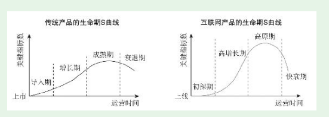

# 第4节-互联网产品最重要的规律——S曲线规律

## S曲线规律

* 四个阶段比较普及的说法和传统产品是一样的，依次是：导入期（或探索期）、成长期、成熟期、衰退期。我对四个阶段命名依次是：初探期、高增长期、高原期、快衰期。重新命名并不是为了标新立异，而是为了更好地体现和传统产品的区别，更直观地体现互联网产品各阶段的特征。

### 初探期

* 如果初探不成功就强行推广，除了浪费公司的钱，还会浪费团队的热情，没有任何意义

### S曲线第二阶段——高增长期

* 过度依赖市场推广的高增长，一旦停止巨额市场推广，产品的关键指标就会立刻跌落。

* **为产品打造内生增长力，是产品经理最值钱的地方，也是判断产品经理层次的主要依据之一。**

### S曲线第三阶段——高原期

* 对直接用户免费的产品，这个阶段有一个非常重要的任务——商业化；本来就向用户收费的产品，这个阶段也会高度关注收入增长。产品的商业价值主要是在这个阶段实现的

### S曲线最后阶段——快衰期

* 随着主要产品进入快衰期，如果有新的产品开启新的生命周期，公司就能再续辉煌；反之，如果没有新的产品接续，公司就会随之衰落。
* 门户业务整体衰落了，但新浪因为有微博（社交领域排第二）、网易因为有游戏（游戏领域排第二）和电商，都能再续辉煌，排在大象群体的前排；而搜狐没有强有力的新产品，已经被挤到大象群体的末尾了。
* QQ为例

* **产品新人不能满足于知道和理解S曲线规律，而是要在具体产品工作中始终关注产品当前处在S曲线的什么位置，重点做好符合当前阶段的事。**
* 顺应规律并不是消极、不作为，产品人要在产品生命期中发挥自己的主动性，让产品走出更漂亮的S曲线。简单来说，就是通过产品工作让公司在产品初探期尽快探对路，尽快进入高增长期。一旦进入高原期要尽量保持继续增长，即便进入快衰期也要想办法尽量延缓衰退。