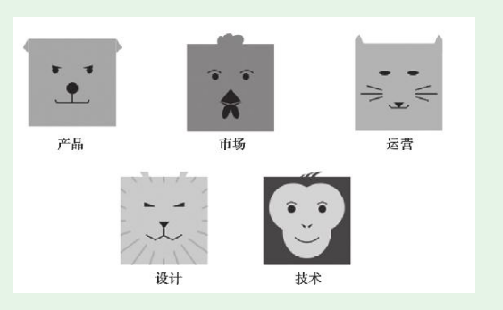
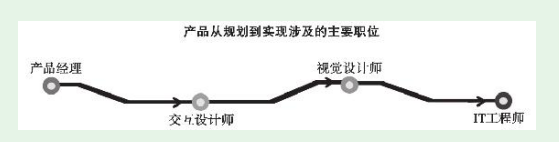

# 第3节　产品人在公司架构和工作流中的位置

## 互联网公司的五大专业职能

* 设计、技术放在底部，绝对不是说这两个职能的地位低，而是表明这两个职能是其他三个职能的基础和有力支撑。产品、市场、运营从左到右排列，基本对应它们在工作流程上的顺序。

* 产品从规划到实现涉及的主要岗位

* 产品实战中，产品经理很可能需要根据设计师、IT工程师的反馈，对产品规划做出调整。理解设计师、IT工程师的工作，在此基础上与他们良好沟通、合作，是产品新人实现高层次入门必须掌握的真功夫