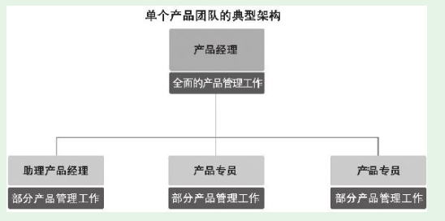

# 第1节　产品新人和产品团队概述

## 新人要把自己放入团队中

* 产品工作非常多，都需要有人来干，产品经理要从全局出发来分配工作，不可能过多考虑新人的好恶。
* 公司花钱请人是为了用人，培养人从根本上说也是为了更好地用人。产品经理对下属的要求首先是把自己分配的工作干好，培养下属从根本上讲也是为了让下属有能力干得更好

## 产品团队的类型和典型架构

* （1）负责一个产品的团队。内部架构很简单：一个产品经理带着几个产品新人，管理层级小，管理跨度小。
* （2）负责多个产品的团队。比单一产品的团队要多一个层次，通常是一个产品总监带着几个产品经理，几个产品经理各负责一个产品，然后各自带着几个人。
* 产品团队普遍是比较扁平的。相对技术、市场、运营等部门，产品团队在整个公司中人数占比是很小的。产品工作不需要人多，而是要人精干。

* 产品新人在产品团队中，在产品经理直接带领和指导下，完成被分配的具体工作，以便整个产品团队能为所在公司持续交付产品规划。

* 所以产品新人如果有机会选择，不要被公司的名气、办公环境、薪酬引导，80%的关注点应放在你每天身处其中的那个小团队。团队的产品经理能力强，团队成员积极上进有潜力，你的成长就快

## 好产品经理的特点

* （1）善于向上管理，能和上级有效对话，争取到重要资源，包括话语权。产品过来人对这一点的认识太深刻了。产品新人如果发现自己的上级——产品经理不善和上级沟通，整天待在小团队里，“醉心”做最好的产品。无论这个产品经理人多么好，产品新人还是应尽快找机会离开。
* （2）产品专业能力强，产品工作全流程、各环节都能独立完成。产品经理必须从商业对接到数据分析，自己都能做，而且能做好。因为这些模块其实是彼此关联，紧密结合的。只有跟着这样的产品经理，才能学得快。
* （3）产品小团队的管理能力强。了解团队成员的水平、成长意愿，据此合理分配任务，并进行指导。——这一点树炀哥还做的不太好

## 好产品团队成员的共性

* 好的团队成员有什么共性呢？最重要的就一条——爱产品。这一条至关重要，这种热爱具有极强的感染力，会深深影响你的成长。
* 有了这一点，大家遇到问题会积极讨论，想办法，会主动学习，乐于分享，上级分配的任务，不仅满足于能按时提交，还会想如何做得更好。