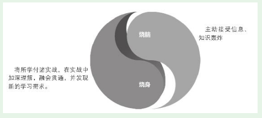

# 第19章　在职产品新人的持续成长

* 产品新人的能力增长确实是有秘诀的，我将这个秘诀形象地概括为：在杠铃模型指导之下的烧脑+烧身。

* 烧脑，是指有意识地、有安排地接触、学习大量的信息和知识，广泛深入地获取营养
* 烧身，是指要不断将所学用之于实战
  * 实战的形式也是多样的，不局限在产品规划上。参加产品活动时，向演讲者提出一个有水平的问题；用心策划并实施一次小规模的用户调查；写一篇学习心得；组织一场产品相关的活动。凡是能拿出实际成果的活动都是实战。

