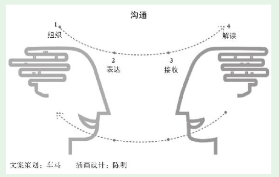
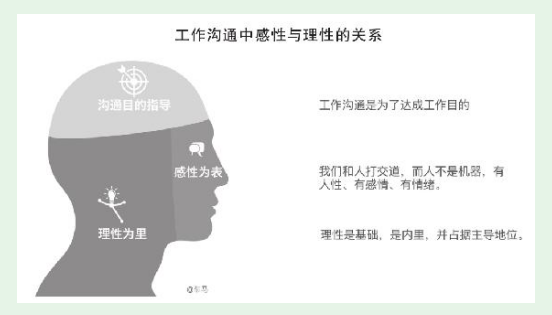

# 第1节　理解沟通的过程，提升沟通能力

* 理解沟通的过程和复杂性，这是我们提升沟通能力的理论基础。

## 沟通是复杂的交互过程

* 表达者、接收者角色互换，再次进行以上四个环节。一次典型的沟通要经过多次角色互换，一次次进行四个环节。

## 沟通容易出现的问题

·组织不力，自己想表达什么没有想清楚；
·表达不力，想得很清楚，但语言、文字等没有表达清楚；
·接收不全或者接收偏差；
·解读不当，没有完全理解对方的意思，有遗漏、有误解，甚至理解的意思和对方的真实意图完全相反。

* 产品新人要在想在沟通力上高层次入门，首先要把上面这张沟通过程图印进大脑中。认识到沟通是一件很容易出问题的事，首先引起思想上的重视，才会采取措施去改善

## 从自己入手改善沟通

* **本能会将问题归咎于他人**
* 我在版本沟通会上对技术说：“关于个人中心显示的“账户总额”，相应的计算规则我已经用详尽的文字做了说明。你们先看，如果有任何疑问，我可以再解释。”
  果然就有新加入团队的技术人员表示不明白（没有表达疑问的同事也不一定真正明白）。于是我又将文字说明换成了非常直观的计算公式。但还是有个别人有疑问，于是我又把公式中的文字直接换成了数据库中的相应字段（在DBA的配合下），告诉技术“账户总额”这个数字，是从数据库的哪些表提取哪些字段，经过怎样的计算得出来的，还用几个真实用户的真实数据去套这个公式。
* 虽然在沟通上花了一些时间，但此后顺利开发上线。很多bug其实根源是沟通问题，产品人如果做好沟通，可以从源头上解决很多bug问题。

## 产品新人的沟通要点

* 要注意沟通目的、感性、理性这个三个要点，以及它们之间的关系

* （1）沟通目的：这是一切的基础。目的决定了具体如何沟通。
  （2）理性：依靠逻辑，谈事。
  （3）感性：面对人性，增进感情。
* ：“让一让，我要下车。下去个胖子，腾出的地方可以站两个人！”听到这句话的人都笑了，真的主动让出了路，让他顺利下了车。
* （1）沟通目的——要请其他人让路，他好下车。
  （2）理性——站在了对方立场，巧妙地传达了对让路者的利益。“给我让路，其实你就更宽松了。”
  （3）感性——语言幽默引发大家开心一笑，解开了心理防线，就更乐意配合。

### 随手练习：
回想一下，你在工作中需要打交道的人里面，你觉得和谁沟通比较难？现在从理解对方的角度列出以下信息。
你认为，他可能因为什么原因，导致他和你沟通不畅？    

1、跟树炀哥，他比较忙，当然大多数我问的问题他都及时回答了我

反省一下，因为你的什么原因，导致了你和他沟通不畅？

2、自身产品相关的知识、技能积累的过少，导致很多事情没法安排给我

* 要主动去做，灌一碗心灵鸡汤——“世界是一面镜子，你微笑，整个世界都对你微笑。”

## 向沟通高人学沟通

* 在他的指点下，我也进行了反思，确实觉得当天的沟通有问题。沟通目的明确，但操之过急忽略了对方的立场。指望靠一次沟通立刻达成一致，结果引发对方不悦，欲速则不达。这样改变打破整个集团常规的提案，不可能靠一次沟通解决。思路清晰、逻辑严谨、表述清楚，但忽略了对方的主观感受。对方的职位比我高，我对其进行逐条反驳显然会让对方不悦，很容易让对方从心理上对立。
* 和高人接触，真是一个不可替代的增长方式