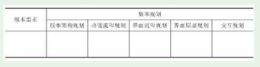

# 第1节　产品规划、版本规划、功能模块规划

## 需求和产品规划

### 需求和产品规划的关系

* **产品人要做的是通过规划产品来满足需求**

* 一个建筑业主想建一个总部大楼，现要对建筑设计进行全球招标。
* 打发无聊时间是很多用户的需求，社交产品、直播产品、短视频产品等虽然差别很大，但都能满足这个需求

### 整体规划与版本规划的关系

* 。如果只有整体规划而没有具体的版本规划，产品是无法落地的。一个个版本如何能顺利衔接，实现产品的一步步成长？这就需要在版本规划之上有一个整体规划
* 整体规划自身也是不断迭

## 版本规划

### 版本规划的两个主要依据

* ：一是产品整体规划，完整的产品整体规划需要靠一个个版本来具体落实；二是对应的版本需求，这是具体的需求，版本规划要直接满足这个版本需求

### 版本规划的内容

* 版本规划再细分

* 向大多数中小产品团队推荐“交互原型+轻文档”的需求表达方式。

### 产品规划、版本规划的三个基本要求

* 《启示录——如何打造用户喜欢的产品》:**有用、好用、可行**
* 有用，市场并不需要这个产品，或者需求量太小以至于根本养不活一个产品，这些情况都叫没用。
* 好用，用户用得爽。但往往是产品人觉得很简单、很好用的功能，真实用户却反映不会用、不好用。
* 可行，不仅是技术实现上的可行，还要考虑运营上的可行
* 可行的边界在变化，原先不可行的在新的技术条件下也许就可行了。人工智能，丰富的**SaaS**，付一点费用就能使用非常先进、强大的功能

### 产品新人在版本规划中的作用

* 产品新人在规划阶段的作用主要是：根据总-分-合的内部流程，负责分配给自己的功能模块、用户端的规划。

## 做好功能模块规划的“秘籍”——高层次地“抄”

* 产品新人规划功能模块并不需要创新，只要会“抄”
* 高层次的“抄”如下图所示：

（1）从整个产品、目标用户、典型场景高度，深入理解其他产品的功能模块。这一步是最重要的，通常也是最难又最容易忽略的

（2）结合自己产品的整体规划、目标用户、典型场景来理解自己负责的功能模块。最好自己先独立思考，再向产品经理请教，这样自己的能力增长更快

（3）完成自己产品的功能模块规划。说得简单、直白一点就是三字诀——抄、合、改。

