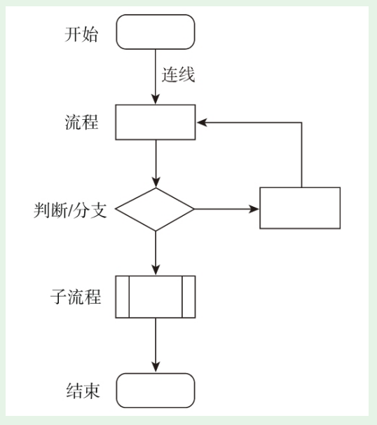
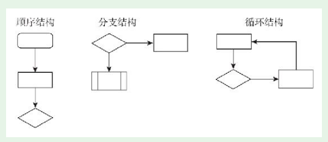
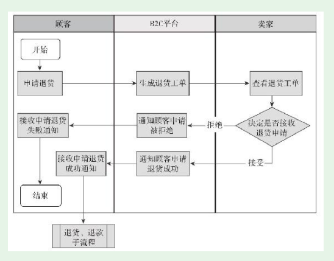

# 第3节　功能模块规划的重要工具

* 本节讲解功能模块规划的两个重要工具。

## 重要工具之一——思维导图

* 思维导图的内容还是以文字为主，通过节点、连线等图形化方式将文字的关系表达出来，即便不做专门说明，也很容易看明白

## 重要工具之二——流程图

* 流程就是规定先做什么、然后做什么。流程可以用文字表达，但更专业的做法是用流程图。
* 比如技术人员普遍反感写注释，但管理得好的技术团队几乎都要求写注释

* 流程有三种基本结构：顺序结构、分支结构、循环结构，如下图所示。

* 如果在此之前你不会用任何流程图工具，我推荐入门用Web方式的ProcessOn。就是前面我们用来画思维导图的Web工具，它也能画流程图

#### 泳道图

* 如果流程涉及的角色较多，或者流程比较复杂，简单流程图就难以胜任了，我们需要借助泳道图。泳道图是流程图的一种，角色之间用平行线分割开，这样看上去像游泳池的泳道。

* 例如，一个B2C电商平台申请退货的流程，涉及多个角色，就可以画成下面的泳道图。

