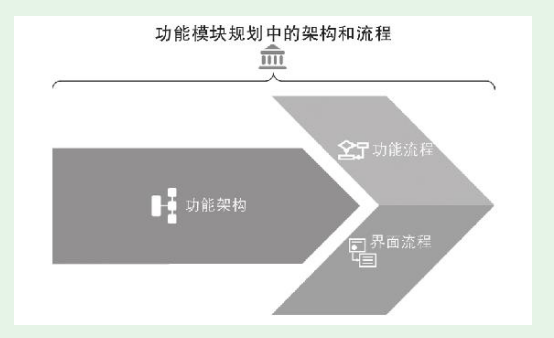
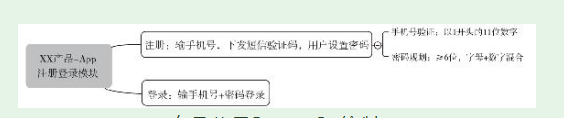
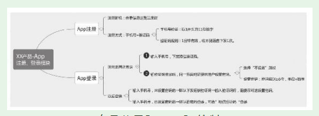
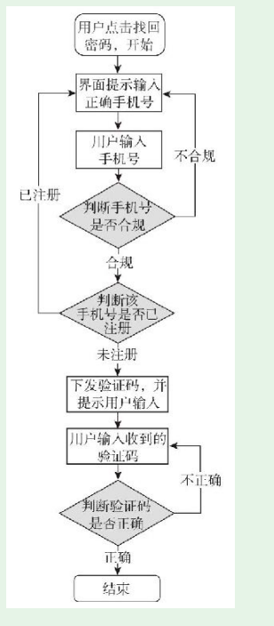
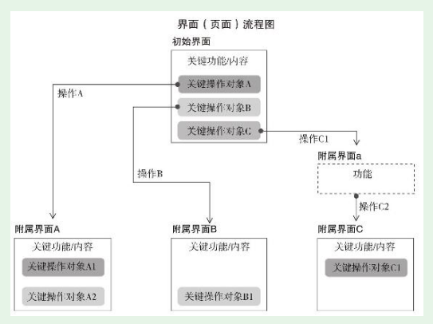

# 第4节　功能模块规划的流程

* 功能模块规划的前三步，可以概括为一个架构、两个流程

## 第一步，规划功能架构

### 示例——app端登录规划

* 产品新人App端的注册登录模块的规划工作

* 修改了的思维导图

## 第二步，规划功能流程

* 功能流程可以用文字表述，但不便于他人理解，通常用上一节讲过的重要工具——流程图
* 是注册登录模块中，找回密码这个功能点的功能流程图

## 第三步，规划界面流程

* 一个功能模块在用户使用时有哪些界面？每个界面关键功能和内容是什么？用户在界面做什么操作，然后去了哪里？
* 有了界面流程图，版本的框架就成型了。

## 第四步，规划界面原型

* 界面原型也叫页面原型，规划出来的界面，和用户最终见到的界面已经比较接近了。

## 第五步，规划交互

* 但现在随着用户端的丰富，用户的要求增加，有些地方仅依靠默认的简单交互已不够，需要进行专门的交互规划。实战中，大多数产品针对部分重要的环节进行专门的交互规划，多数地方仍然用基本交互。

## 不忘初衷——适合场景的功能规划

* 功能模块规划要不忘初衷，这个初衷就是打造出适合场景的功能。产品功能要满足用户需求，但只有充分考虑应用场景才能真正满足用户需求。
* 产品新人在进行功能模块规划时，要不忘初衷。简单、复杂不是标准，适合场景才是———通讯录同步软件

### 随手练习
你本人在实际使用产品的过程中，有没有注意到什么产品的功能规划特别适合你当时的场景？
这个产品是：坚果云
当时的场景描述：我想要在手机上看一个电脑写的文档，但电脑开机、打开文档操作费时
描述一下这个功能：能把电脑和手机的文件进行本地同步

