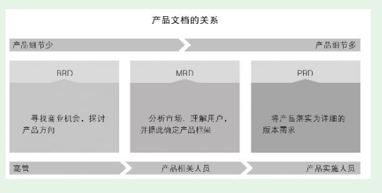

# 第5节　版本规划的表达以及实现过程

* 既然要设计、技术人员来实施，那么仅产品人自己想清楚还不够，还需要让设计、技术人员也能清楚。这就是设计如何表达需求的问题了
* 规划的表达主体形式是文档和原型。

## 产品表达的文档
### 产品管理中的常见文档

* 业界有三大文档、四大文档之说。先介绍三大文档。

（1）BRD：Business Requirements Document，商业需求文档。这是三大文档中最早出现的一个，主要是对市场进行分析，发现其中的机会，其中有产品大方向但没有产品细节

是层次较高的产品经理和公司高管讨论时使用的。

（2）MRD：Market Requirements Document，市场需求文档。如果BRD定的大方向获得公司高管认可，就要进一步细化写MRD了

产品有了关键功能描述、功能模块划分等内容，其中通常包含了思维导图、功能列表等。

（3）PRD：Product Requirements Document，产品需求文档。这里的产品需求是产品团队对设计、技术团队提的需求，其实就是产品规划（更具体地说是版本规划）

### PRD文档的结构

* PRD的价值就是定义产品需求，在团队内达成关于实现目标的共识。PRD的主要使用对象有：项目经理、设计师、开发人员、测试人员、运营人员。

#### PRD文档的核心内容

* 共性的核心内容，掌握这些核心内容是写出合格PRD的关键

·整体产品结构，功能模块、功能点的划分及其之间的关系；
·功能的清晰表述，包括功能流程图、界面流程图、用例；
·文案、图片、表格等静态内容及其大体版式；
·动态内容的样例、数据来源；
·交互说明；
·非功能需求。

* PRD文档的其他内容

·文件命名，要求清晰、简洁，保证在全公司都不会出现重名现象。可以采用《公司名+产品名+版本号+“产品需求文档”》

·文档修订记录，包括修订序号、修订日期、版本号、修订说明、修订人

* **写PRD文档的难点不是格式和文笔，而是自己有没有想清楚、想全面、想细致。**

## 原型

* 我推荐新人多数情况下规划一种高保真原型——真机交互原型。相比其他原型，它有两个很有价值的特点：

·可真机体验。为PC Web等为PC规划的用户端，设计人员、技术人员直接就能在PC上体验；App、移动Web、小程序等为移动端规划的用户端，则可以直接在手机上体验。

·可以交互体验。设计人员、技术人员可以在真机上对原型进行模拟操作，而原型会做出相应反应。

## 版本从规划到实现的过程

* 真实的产品实战永远充满问题，需要我们去解决