# 第2节　App端规划的实战要点

* 个好的App规划要考虑三个“便于”——便于眼睛看、便于手指操作、便于大脑理解，这三者要有机结合起来。

## App规划中对手指操作的考虑

* 产品人规划的App最终是让用户顺畅使用。如果产品规划中对手指操作的理解不够，就会让用户难以操作

### 方便手指操作的标准

* 一份研究报告显示，用户手握智能手机的方式有三种：
  （1）单手握并操作：49%。
  （2）抱握，也就是一手握住手机另一手操作：36%。
  （3）双手握、双手操作：15%。
* 具体用左手还是右手触碰屏幕，也有数据——左手指为33%，右手指为67%。
* 除了抱握方式，另外两种方式中用户几乎都是用拇指来触碰手机
* **App规划方便手指操作的标准：让用户无论是左手还是右手单手握机时，拇指都能方便地进行主要的、常用的操作。**

## 大屏给手指操作带来的挑战

* 在越来越大的屏幕上，让左右手拇指都能便利操作，是一件很考验产品人功力的事情。

* 我的手稍微大一点，但其他人操作起来可能就没那么容易了

  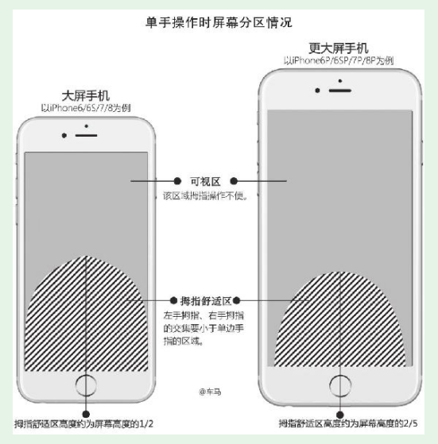

  ### 随手练习：
  回顾一下，你本人在使用App的过程中，有没有遇到过手指操作不方便的情况？（一定有）拿起手机，找到这个App并进入相应界面。结合刚刚学到的知识，分析一下原因。

  小米手机拍照：我自拍时想对焦，但对完焦点击拍照的按钮时手又会移动，对焦失败，手机屏幕过大，对焦的地方不在我手指的舒适区

  同样的任务、同样的操作，用左手、右手分别体验，加深理解

## 方便手指操作的解决方案

* 如iOS就已经实现了双击Home键，将屏幕显示内容下拉的效果。小米手机的MIUI、OPPO手机的Color OS系统都有单手模式

* 脱离操作系统的解决方案

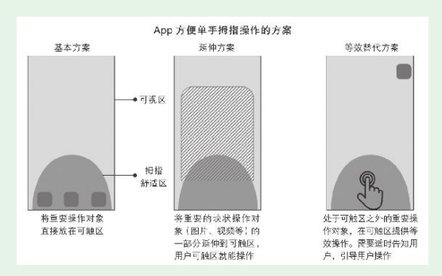

* 等效替代方案——快手、抖音点赞

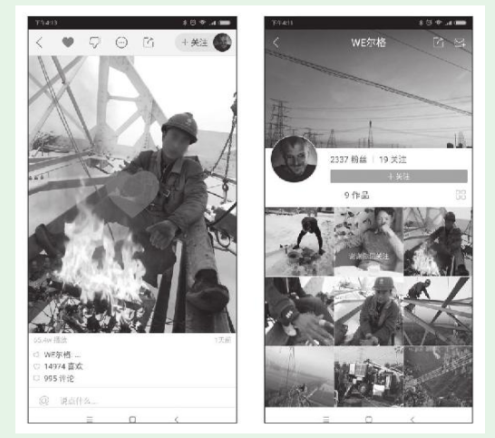

## App的基本手势

* iOS和Android平台支持的手势不完全相同，不过有8种基本手势两个平台都支持

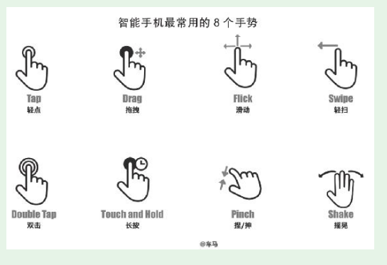

* 如果产品的用户中年长者的比例较大，“双击”“长按”手势就要慎用，或者有等效的替代方案。因为这些手势，很多年长者要么不知道，要么不会熟练操作。

## App全局导航

* 导航也是分层级的，有整个App的全局导航，也有各模块的局部导航。

* 在规划全局导航时，要注意用户的“三易”原则：
  （1）易见

  （2）易理解

  （3）易操作

* 总体而言，导航分为两大类：
  第一类，边角导航

  第二类，页面内导航

### Tab Bar标签式导航

* 两个主要的扩展形式：
  （1）中心扩展式导航

  （2）滑动扩展式导航

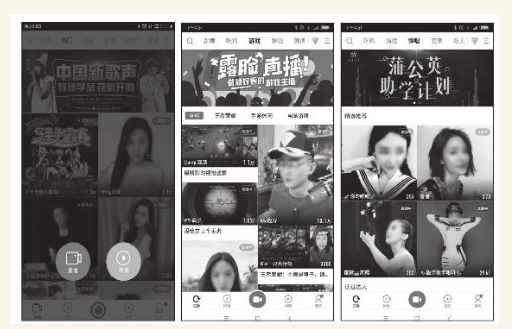

### 抽屉式导航

* 三条横线的样式，和汉堡包的结构有点像，因此又被称为汉堡包导航

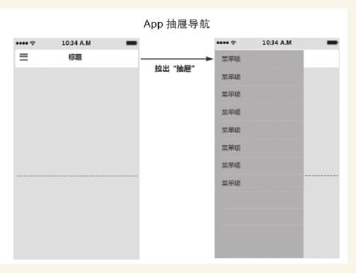

### 悬浮icon导航

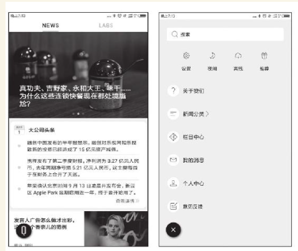

#### 随手练习：

使用抽屉式导航、悬浮icon导航的App比较少，除了上面列出的App，再各找出一个采用这种全局导航方式的App，把产品名称下来。

采用抽屉式全局导航的App：网易云音乐

采用悬浮icon全局导航的App：小米系统

### App端全局规划通用模板

* 新人准备了一个通用模板——车马梳子模板。

    

  图示中导航Tab Bar在界面底部，这只是示意。产品实战中，有三种情形：

    

  （1）只有底部Tab Bar，轻点（Tap）Tab切换，可能有等效操作——横向滑动（Flick）界面切换Tab。

    

  （2）只有顶部Tab Bar，轻点（Tap）Tab切换，几乎是一定要有等效操作——横向滑动（Flick）界面切换Tab。

    

  （3）既有底部Tab Bar又有顶部Tab Bar，都支持（Tap）Tab切换。横向滑动（Flick）只用于其中一个Tab Bar的切换等效操作，以避免操作冲突和理解困难。

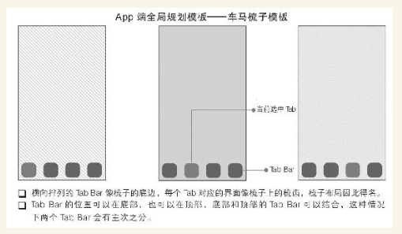

## 界面的内容形式和布局规划

* 有先有独立界面，才会有相应的附属界面

### 为内容选择合适的呈现形式

* 合适的内容组织形式将众多内容组织起来，构成一个有机协调的完整界面。这就涉及布局规划

（1）表格视图（Table View）：表格视图以可滚动的单列多行的形式来展示信息。iOS定义了两种表格样式——平铺型（Plain）、分组型（Grouped）。

  

（2）集合视图（Collection View）：集合视图用于管理一系列有序的项，并以一种自定义的布局来呈现它们。

  

（3）页面视图（Page View）：页面视图控制器通过滚动（Scrolling）或翻页（Page-curl transition style）两种方式来处理长度超过一页的内容。

  

（4）滚动视图（Scroll View）：滚动视图方便用户浏览尺寸超越滚动视图边界的图片（如下图所示，知乎的一个放大的界面图片无论是长度还是宽度都超过了视图边界）。

  

（5）分栏视图（Split View）：分栏视图是一个用于管理两个相邻视图的全屏视图。可以在横屏环境中并排展示两个窗格，可以让主窗格在详情窗格上方显示，也可以在不需要的时候（尤其是竖屏情况下）隐藏主窗格。

* 产品人必须紧密结合产品特点、用户特点、场景特点、内容特点选用合适的内容组织方式，如果脱离这些要点盲目追赶流行，那就是本末倒置了

### 交互反馈的规划

* 用户和界面持续交互，界面需要对用户的操作做出适当反馈

#### 通过控件状态变化提供反馈

* 可以给控件增加多个状态，让用户知道App已经接收到他的操作

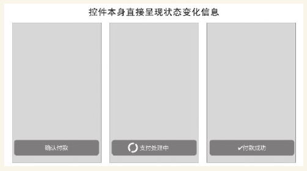

#### 通过附属界面提供反馈

## 对初始状态、少数用户的专门规划

### 对初始状态的专门规划

* 初始状态下用户还没有任何个性化数据，往往会不知所措，这时最重要的是对其加以引导，让用户尽快脱离初始状态。

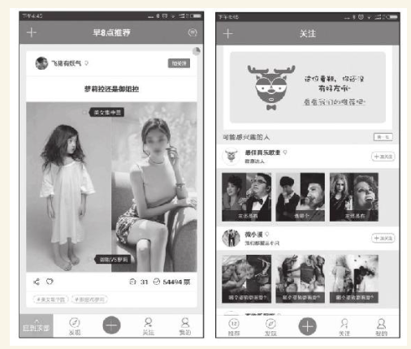

* 新用户打开App是没有好友的，微愿会主动给用户推荐。

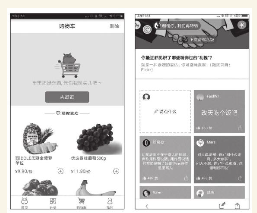

* 如果做A/B测试，我相信数据可以证明这种方式比常规方式更好，能引发更多用户发言

### 对少数用户的专门规划（以色盲用户为例）

* URL [www.toptal.com/designers/colorfilter](http://www.toptal.com/designers/colorfilter)在页面的输入框中输入一个Web网址，显示出来的就是色盲者眼中的效果

* 针对色盲用户已经有成熟的解决方案，主要靠设计师来实施。