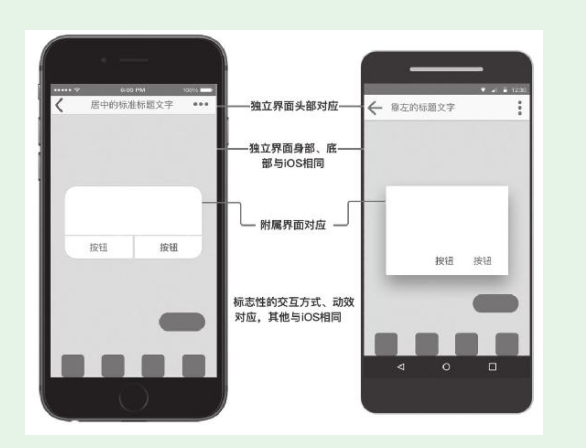
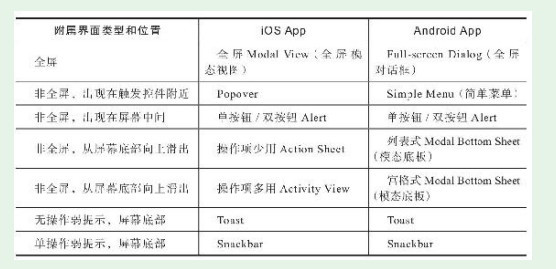
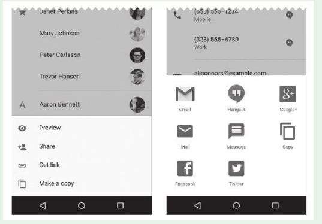

# 第4节　为Android、iOS双平台做规划

* iOS和Android基本垄断了智能手机系统，所以当前产品的用户端如果有App，几乎都有两个平台的版本。而且在两个平台上，App的版本迭代也基本同步。

## 双平台App规划的基本方式

* 产品人如何为两个平台规划App？基本的方式无非两种：
  （1）产品经理为两个平台各做一份规划，充分考虑两个平台的特点，将各平台的规划分别交给对应的用户端开发团队去开发实现。
  （2）产品经理只做一份“通用”规划，将这份规划同时交给两个用户端开发团队，并行实现。

## 双平台App规划的改进方式

* 这个方式概括而言就是：一份iOS平台上的规划+一个Android平台上的对应规则
* 平台为什么选iOS，而不是Android呢？主要原因有两个：
  （1）iOS的规范被执行得更好。
  （2）Android平台更加开放，开发实现时受到的约束更小。

### 一份iOS平台上的规划

* 关键点有：在交互原型工具中选典型的iOS设备尺寸，尽量选用iOS的标准元件。

### 一个Android平台上的对应规则

* Android平台上的对应规则是可以渐进增强的

#### 独立界面头部的对应

#### 独立界面身部、底部

* Android App的身部、底部的内部、布局、样式与iOS App相同。

#### 附属界面

* 附属界面是Android平台和iOS平台区别最明显的地方，Android附属界面和iOS附属界面的对应关系如下：

* 列表式模态底板、宫格式模态底部

#### 操作方式与交互动效

* Android平台在两个标志性的地方使用Android的方式，其他和iOS相同。这两个标志性的地方是：

·对列表项的操作方式；
·单击控件出现的涟漪动效。