# 第2节　PC　Web端规划的要点

## 传统的PC Web全局导航

* 手机Web向App学习导航方式，然后PC Web又向手机Web学习导航方式

### 顶部横向导航

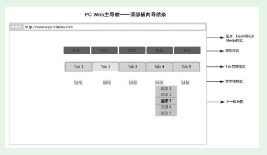

（1）位于Web页面顶部，整体横向排列，处于最易被注意到的位置，用户基本都会注意到。
（2）基本样式有四种：文字链、Tab（页签）、按钮、图片和其他富媒体形式。
（3）一级导航项目可以展开。

* 原型工具mockplus的PC Web端的顶部导航

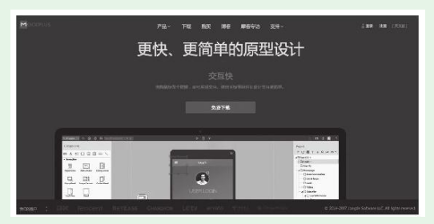

* 陆金所的PC Web导航
* 这个二级导航项的排列方式没有用通常的纵向列表，而是用了横向列表。这样做有一个好处，它对下面的内容遮挡少

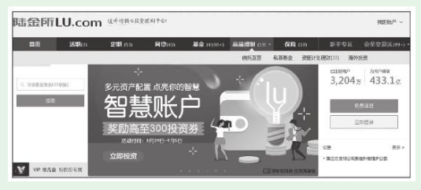

### 侧边纵向导航

* 展开的下级导航栏可以持久存在，而且多个、多级展开项可以同时持久存在。
* 运营人员使用的运营系统，PC Web普遍使用这种导航方式。因为侧边纵向导航便于展开，可以容纳非常多的操作项，而这往往是运营系统的特点。

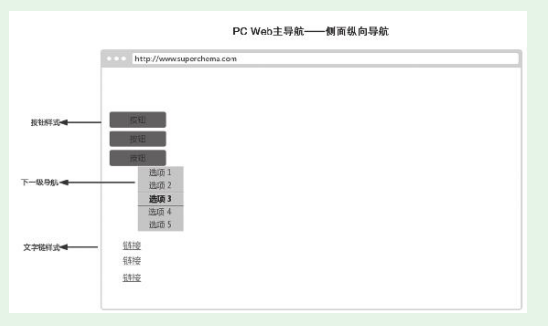

### 纵横结合+搜索辅助

* 主导航在左侧边，列出了所有的商品类别；上部横向导航条，列出了几个主推的分类；再加上顶部的搜索栏。

### Web全局导航的辅助——面包屑

* 小孩子出门时，沿途撒下面包屑。迷路后，跟着先前洒下的面包屑，就能顺利地找到回家的路
* 京东图书，“图书>管理>商务实务>中信出版>刷新：重新发现商业与未来”就是典型的面包屑

* 看典型面包屑的两个主要作用：
  （1）指示位置的作用。

  （2）在指示位置作用的同时，面包屑还提供了便利的跳转功能。

* 产品新人在掌握面包屑导航的时候，要注意以下问题：
  （1）面包屑是全局导航的辅助，而且不是必需的。

  （2）不要将当前页链接加到面包屑中。

  （3）面包屑内容要有合适的大小和间隔，并且使用简单、统一的连接符。

* 面包屑可以通过适当的规划，实现和主导航的有机融合。

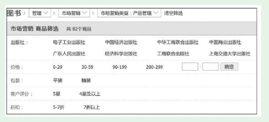

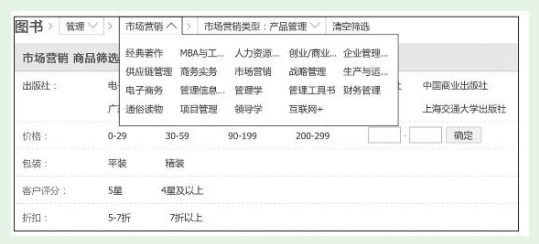

## PC Web页面整体布局的规划

* 视觉美观和页面内容中找到一个平衡点。按照分栏方式的不同，可以将网站的界面布局分为单栏式、两栏式和三栏式。

### 单栏式布局

* 页面重点突出，方便用户直达最重要的功能。同时，排版方式受到局限，页面可承载的信息量小。
* 如搜索引擎首页、表单填写页面。

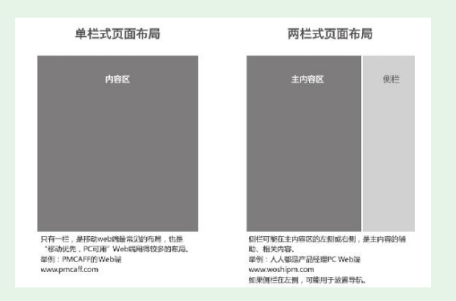

### 两栏式布局

### 三栏式布局

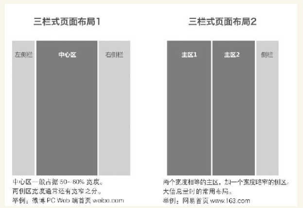

### 随手练习：

  

除了搜索引擎首页，你还见过哪个PC Web网站的首页采用了单栏式布局？cnki

### 对基本布局的混合、嵌套应用

* 纵向

## PC浏览器兼容问题及其对策

### 浏览器兼容问题

* 同样的代码，在不同浏览器上可能表现为不同的效果，这就是浏览器兼容问题。对这个问题理解最深的是Web前端开发人员，产品新人可以向他们请教。
* 浏览器兼容问题大致可以分为两类：显示兼容性问题和功能兼容性问题。
* 这个属性Chrome、IE9都支持，但IE8却不支持。如果产品人规划的某个功能，技术实现时使用了textContent属性，用IE8的用户就不能正常使用这个功能。
* 产品新人可以访问百度流量研究院（http://tongji.baidu.com/data/browser），查看最新的国内PC浏览器的版本分布情况。

### 浏览器兼容的对策

（1）根据所做产品的用户特点，选定兼容的浏览器列表

对于已经上线运营一段时间的Web端，可以从服务器获取用户的浏览器信息。

有些产品的Web端可能对浏览器的限定更加明确——指定一种浏览器，除这种浏览器以外的，或许可以使用但不保证效果。

* 小结一下，目前主流的浏览器兼容策略有四个策略：

    

  ·最大兼容。包括“古老”浏览器（主要是指IE6、IE7、IE8）和主要的现代浏览器（IE9+、Chrome等）。

  ·较大兼容。IE8和主要的现代浏览器。

  ·兼容主要的现代浏览器。

  ·只确保一种主要的现代浏览器，通常是Chrome。

* 实战中，大多数产品采用较大兼容策略和兼容现代浏览器策略就能满足需要。

（2）对兼容列表中的浏览器，向前端开发人员系统了解他们的兼容问题，在规划阶段就尽量回避这些问题

（3）提交Web端规划后，主动和Web前端开发人员沟通，了解涉及的兼容性问题。对部分问题可以对规划略作调整，再次回避一些兼容性问题，减少开发量

### PC Web规划的其他考虑

#### 404页面

* 知乎、搜狐畅游的404页面

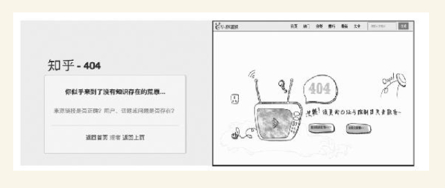

* （1）要告诉用户“您访问的地址不存在”或“您请求的网页服务器没有找到”。

    

  （2）可以结合产品和用户特点，规划相应的其他文案或配图。

    

  （3）为用户提供1～2个去向，用户不需要关闭这个404页面，单击就能跳转到其他页面

  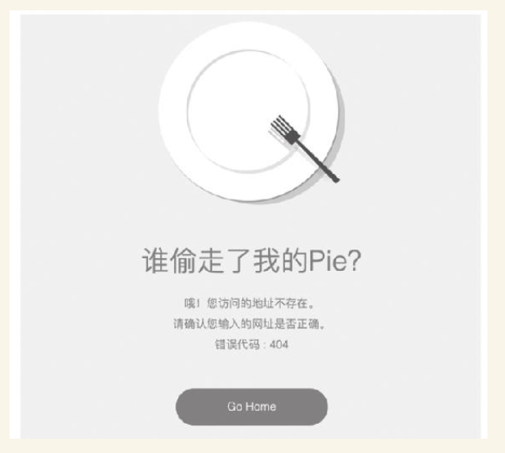

* 网易更是利用404页面从事寻人公益活动，将异常状态从坏事变成了好事。

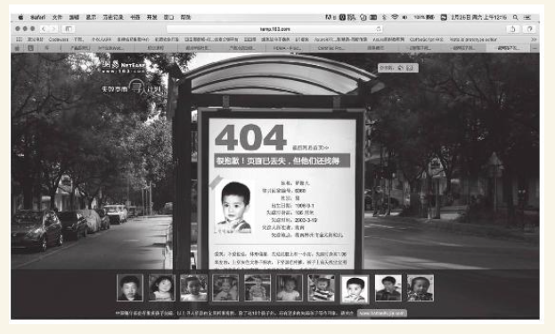

* 对SEO的考虑

SEO是Search Engine Optimization（搜索引擎优化）的首字母缩写。

产品的Web端能出现在搜索结果中，而且最好排名靠前，这样可以获得大量用户

（1）内容尽量文字化，尤其是导航。搜索引擎只认文字，不认图

（2）HTML标签语义化、TDK标签、Tag标签优化，这同样是为了便于搜索引擎理解。

（3）专门提供站点地图——XML地图、HTML地图。

（4）网站URL的优化，尽量用静态、少层级、有规律、简短的URL。

建议新人去百度搜索资源平台（[HTTPs：//ziyuan.baidu.com](https://ziyuan.baidu.com/)）系统学习SEO知识。