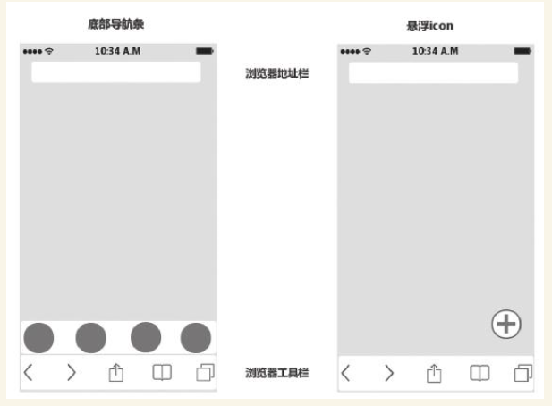
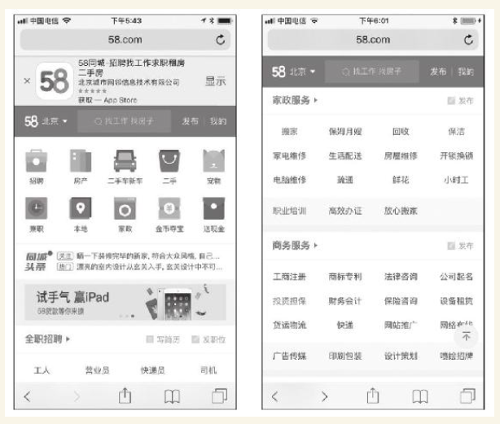
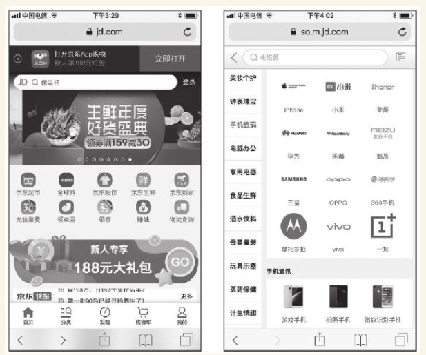

# 第3节　手机Web端规划的

# 特点和要点

* 本节主要讲手机Web的特点，手指动作规划，导航、App下载引导的规划，这些都是手机Web端的要点。

## 手机Web端的特点

### 手机Web和PC Web的区别

（1）屏幕大小

（2）操作方式

（3）性能

（4）浏览器的区别

### 手机Web和手机App的区别

（1）手机Web比手机App规划的内容略少，没有App规划要涉及的启动页、推送等。

（2）手机Web受手机浏览器的限制，各方面的能力都不如App强大。

（3）手机浏览器通常顶部有地址栏，底部还有浏览器的常用工具栏。

（4）典型的多端产品，产品经理非常希望访问手机Web的用户能下载App

### 手机Web端规划的要点

* 要点是“一个前提，一根手指，两个问题”
* 所有资源都是请求时才下载，所以规划手机Web要简洁，让页面即便在较差的联网条件下也能较快加载
* 充分考虑一根手指的功能和便利性。
* 两个问题：手机Web导航规划和App下载引导规划

#### 手机Web的手指动作规划

（1）将Web页面上的主要操作、常用操作尽量集中在页面下部，也就是屏幕下部，方便手指操作。用鼠标操作的PC Web基本不用考虑这个问题。

（2）对用户在手机Web页面中的手指操作做如下规定：

·手指在页面上下滑动，让页面上下滚动；

·手指对页面中的元素只有三个动作：单击、拖动或滑动；

·手机单击页面中的表单元素调出软键盘进行输入；

·避免和浏览器冲突的手势。

#### 手机Web的全局导航规划

（1）手机Web全局导航——边角导航

（2）手机Web全局导航——页面内导航

* 京东

#### 手机Web端中App下载引导的规划

在移动Web页进行好的App引导，要注意以下几点：

  

（1）减少干扰。

（2）适合场景。用户通过wifi上网时，引导下载App的成功概率显然更高。

（3）引导合理。

#### Web端的App化倾向及对策

* 在首先保证良好的用户体验的前提下，再去追求风格统一。