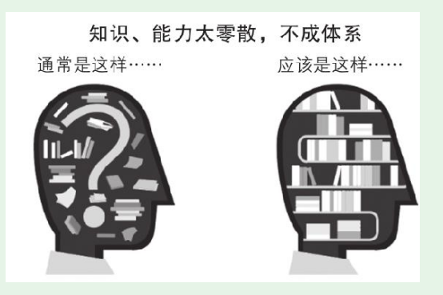
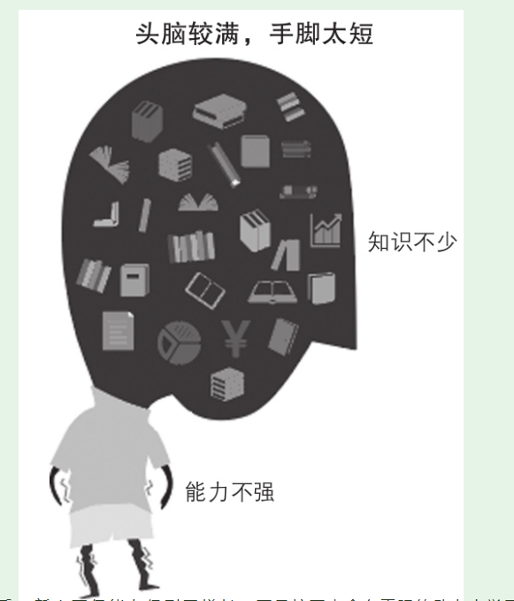
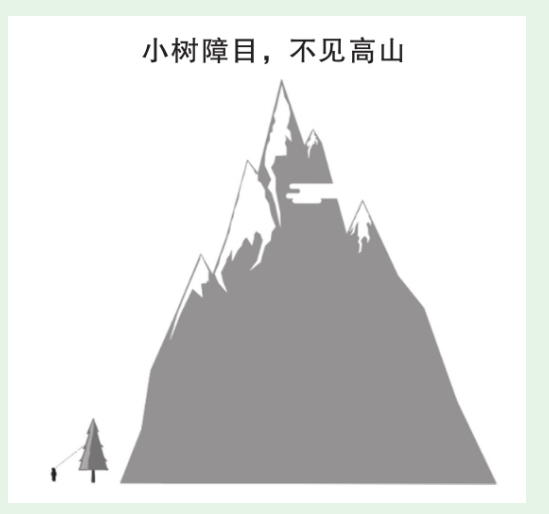
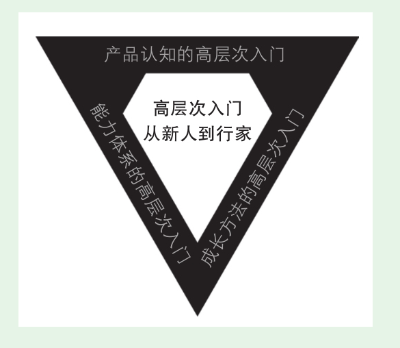

# 产品认知篇-理解互联网产品和产品管理

* —对现在的产品新人而言，高层次入门不仅是发展的需要，更是生存的需要！

## 低层次入门的四大原因

### 你和大脑合谋骗了自己
* 互联网让一切都更加便利，包括自欺欺人。听过、看过、买过、订阅过、下载过、收藏过，就以为自己掌握了知识，吸收了精华。**重要的是学位所用**

* 未经你思考的知识，不是你的知识；未经你实战的能力，不是你的能力。不是把自己的大脑和日程塞满，而是先把一本好书读透

### 知识零散，不成体系

### 头脑较满，手脚太短

* 没有尽快主动应用这些知识，将知识内化为能力。这样的结果是“学得多，忘得快”。久而久之也就丧失了继续学习、继续提高的动力，再难提升。

* 刻意行动要尽量靠近产品火线，这是和其他新人拉开层次最根本的方法。

### 小树障目，不见高山

* 绝大多数产品新人能接触到的就是普通的白领产品经理，接触不到更高层次的金领产品经理，更不用说最高层次的首席产品官了。

## 高层次入门的指导思想

* 勤奋对解决以上问题的价值不大。知道该在什么地方勤奋以及如何正确地勤奋，比勤奋本身更重要。

（1）产品认知的高层次入门：只有高层次的认知，才能带来高层次的结果。
（2）能力体系的高层次入门：清晰的产品能力体系，指明了努力目标。
（3）成长方法的高层次入门：高效的成长方法，让目标更快达成。

## 如何高效使用本书

* （1）要仔细阅读，不要满足于浏览。
  （2）要行动，不要止步于阅读。
  （3）把本书当成一个“书架”，在本书的体系指导下扩展学习。

中学地理第一课就是“地球在宇宙中”，从宇宙开始逐步讲到银河系、太阳系，最后到地球。本书借鉴这种方式，安排了一篇三章的内容。从互联网商业、互联网公司开始，讲到互联网产品、产品管理，帮助产品新人实现产品认知的高层次入门