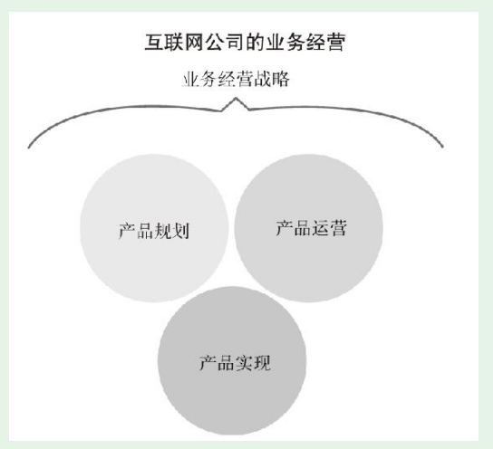

# 第2节-互联网公司的业务经营

* 以产品为中心的互联网公司其业务经营由哪些要素构成？它们之间又有什么关联？概括而言就是1+3结构

* 。为什么要做这个产品？这个产品目标用户是谁？产品有很多方向、很多可能，为什么单单要做这个方向？为什么有些功能，用户喜欢却反而要砍掉？

* 互联网商业的整体战略有其特殊性。它最初可能很模糊，中间也可能做大调整，但它是整个互联网公司业务经营的灵魂。

## 经营战略靠产品落实，通过运营获得市场反馈，然后反推经营战略

