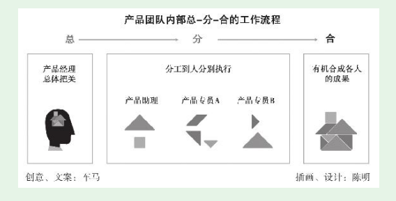

# 第2节　新人在产品团队中立足和成长的要点

* 但仍常常处于迷茫之中，他们找不准自己的位置，感觉进步慢，但又不知道该怎么改进。这恰恰是没有高层次入门的标志。——**这恰恰是我现在的感觉**

## 理解并适应“总-分-合”的工作流程

* 出于效率等考虑，他通常会带团队一起做，团队中就有你——产品新人。产品新人就是在产品经理直接领导下，从事部分产品工作。

* **产品新人先做好“分”给自己的工作，再去做“总”与“合”的工作。**

* 不要指望刚入产品之门，就能全面负责一个产品，这样的机会基本上不会有了。产品新人要确保：
  （1）在产品“总”的阶段，自己能理解产品经理；
  （2）在产品“分”的阶段，自己投入饱满的热情，把分给自己的部分做好、做细；
  （3）在产品“合”的阶段，自己能主动辅助产品经理完成整合。

## 管理好最重要的人——产品经理

* （1）把产品经理当成你最重要的用户！你的产品经理就是重要的能量来源，他至少现在比你强。同样是2～3年的时间，态度不同，能从产品经理那里学到的东西可以差几倍。
* （2）先把分给你的工作做好，而且要让产品经理知道你特别想做好。
* （3）产品经理在给产品新人分任务之前，一般会有些讲解，他会告诉你他是怎么考虑的。最初产品新人就是听，之后可以开始尝试先思考后提问，当然这是要讲技巧的。

* （4）主动从产品经理处争取帮助他“合成”产出物的机会。如果前面的总、分做得到位，那么这个阶段的工作主要就是看细心了。
* 这种合成是有机合成，不是单纯的文件操作。争取到这样的机会，可帮助产品新人锻炼全局掌控能力。如果做得好，产品经理很可能会调整你的分工。本来你只是在一个产品团队中，负责App端部分功能模块的规划，下一个版本分工时，产品经理可能就会让你负责整个App端所有模块的规划。如果有这样的锻炼机会，离真正的产品经理就又接近了一步。