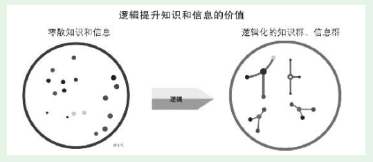
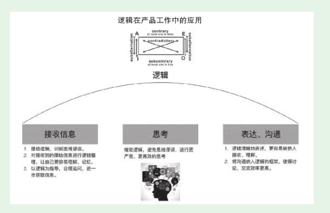

# 第2节　逻辑能力的提高和应用

## 逻辑提升知识和信息的价值

* 知识和逻辑的关系

* 零散知识和信息转化为逻辑化的知识群、信息群，也就是我们常说的“融会贯通”

## 学习逻辑知识提高逻辑能力的方法

* 产品新人该如何系统学习逻辑知识提高逻辑能力

（1）看一两本关于逻辑学的好书，系统了解逻辑知识。看似要花费一些时间，其实是收获很大的事，而且用其他方法无法代替。主要看形式逻辑，数理逻辑等内容不用涉及。看关于逻辑学的普及型书，例如《简单逻辑学》

（2）搞清楚我们的目的，不要陷入关于逻辑学的争论。

（3）要培养逻辑能力，而不要培养解答逻辑题的能力。

## 逻辑在产品工作中的应用

