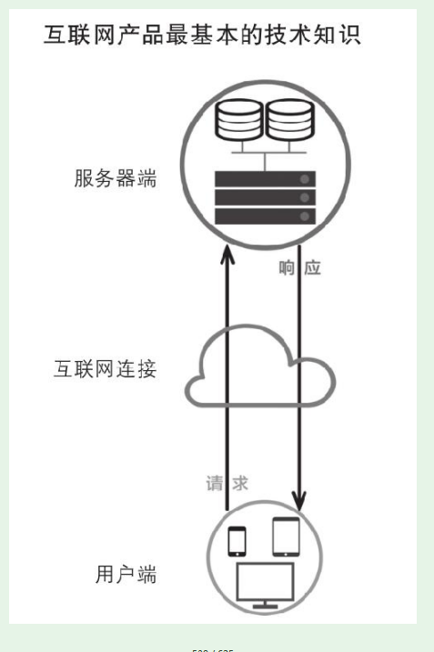
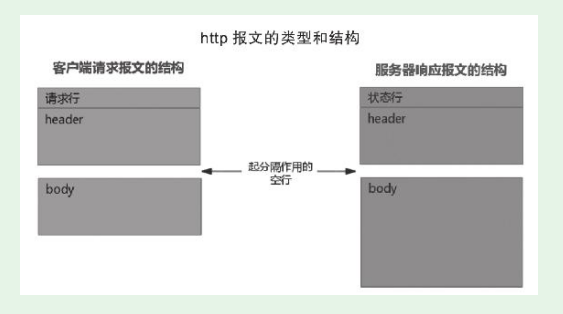
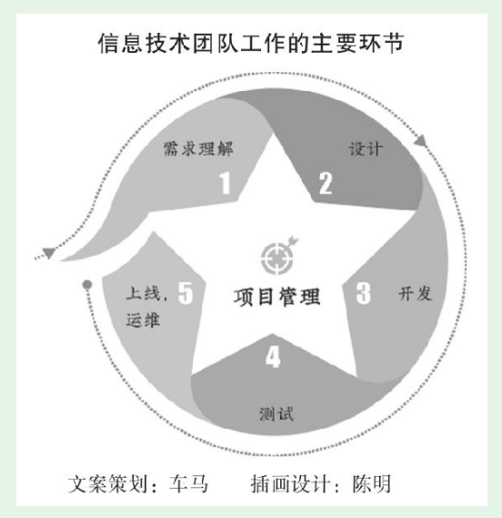

# 第2节　最基础的技术知识及其应用

## 产品新人最基础的技术知识

### 产品人的技术知识原点图

* 是我原创的技术知识框架，用了形象直观的方式表示。

### 用户端

* 运行在用户设备上的代码和资源。主要包括：Web前端（HTML、CSS、JS），App端（又分为iOS和Android）等
* Web前端开发，工作重头就是写JavaScript代码

* iOS的App用Object-C、Swift语言开发；Android用Java语言开发。

* App端开发中可以融合Web前端技术（称为Hybrid App），可以实现代码复用，为公司节约成本

### 互联网连接及请求/响应

* 客户端、服务器之间通过HTTP报文传递数据，HTTP报文有一定的格式。下图是两种报文的结构

* JSON是JavaScript Object Notation的缩写，是一种轻量级的数据交换格式，在互联网的用户端-客户端数据交换中使用非常普遍。
* 在浏览器输入mail.qq.com，接下来浏览器向QQ邮箱的服务器发送了一个请求；服务器给出了一个HTTP响应，将一套前端代码和资源传给用户浏览器

### 服务器端的程序

* 些程序用PHP、Java、Node.js、C++等语言开发
* Cookie和Session，服务器要处理众多用户的请求，需要区分每个用户，返回给每个用户所需要的内容。这就涉及Cookie和Session。
* Cookie是服务器给每个用户分配的唯一ID，这个ID由用户浏览器保存。而Session则是服务器为了维护这个会话在服务器端保存的与Cookie对应的用户数据。

### 服务端的数据/文件资源

* 服务器端不仅运行着程序，还保存着海量的信息。根据保存和管理方式，可以分为放在数据库中的数据、没有放在数据库中的文件
* 主要有两类：关系型数据、NoSQL数据库。两者各有一个知名度很高的代表：MySQL、MongoDB。

## 理解技术工作和技术团队的工作

### 厘清技术的几个基本概念

（1）技术与开发。搞技术的有很多专业分工，不一定是搞开发的

（2）开发与研发。开发就是编程实现产品需求，而研发是“研究和开发”的意思。其中的研究是对技术的前沿进行探索

（3）开发和编程（写代码），开发的范围更广，开发工作包含了编程，但不仅仅是编程

（4）测试与验收

验收产品时肯定会进行实际使用，产品人自己往往认为这就是“测试”，其实这叫“体验”“试用”。

产品新人与技术人员尤其是测试人员沟通时，要表现出对测试的专业尊重。不要说“我昨天测试了一下，发现……”，而要说“我昨天试用了一下，发现……”

### 技术团队工作主要环节

* 产品和技术之间有一个非常重要的会议——需求评审。

* 需求评审会通常由对应的产品经理主持，产品新人也会参加。轮到自己负责的功能模块、用户端，产品经理可能会安排新人来说明、回答。这是个很好的锻炼机会。
* 整体的、全局的设计叫架构设计，由架构师或技术团队水平很高的人担任。
* 少分为：后台开发、Web开发、移动开发（往往又分为iOS端开发、Android端开发）。有些还会将后台开发细分出数据库开发、接口开发等。
* 进行测试，把问题找出来，让开发人员修改
* 定测试策略和测试计划、写用例、写脚本、提交并追踪bug。其实不只开发人员要写代码，测试人员也可能要写代码。
* 测试通过后，还要发布到服务器上，这样用户才能真正用上新产品、新版本。 
* 上线运行之后，还可能出现各种状况，需要及时发现、及时应对。这些工作统称运维（运营维护的意思），一般也是由专职人员负责的。
* 现在流行敏捷开发，比以前大型软件产品的普遍采用的瀑布流方式迭代得更快。

敏捷开发并不追求前期完美的设计、完美编码，而是力求在很短的周期内开发出产品的核心功能，尽早发布出可用的版本。然后在后续的生产周期内，按照新需求不断迭代升级，完善产品。

敏捷开发介绍：https://blog.csdn.net/csdn15556927540/article/details/90712308

### 理解技术团队，避免产品需求的碎片化

* **在实战中，需求变更是很难避免的。但好的产品人员，会尽量减少这种变更。**
  **这不仅体现能力，还体现道德。**
* 产品新人请理解和尊重技术团队，管好自己，提升提需求的水平。