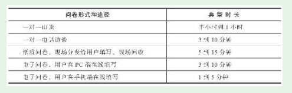

# 第3节　调查问卷的设计

* 调查问卷的设计有三个方面要重点考虑：问卷时长（篇幅）、问题类型、问卷结构（如何安排问题的顺序）

## 问卷时长
* 一般而言，我们都希望从用户那里获得尽量多的信息，但实战中会受到问卷时长的限制。

## 问题类型

* 开放性可以将问题划分为三种类型：封闭式问题（只能在给出的有限选项中做选择）、开放式问题（没有给出确定选项，由用户自己填写）、半封闭式问题（以上两种类型结合）

* 所以一份问卷中通常开放式问题不能太多，而且要描述清楚让用户正确填写。例如，“您投资的第一个P2P平台是_________（请填写这个平台的中文名称）”

## 问卷结构

* 问卷结构应该符合逻辑顺序，和用户的思维顺序基本一致，从而便于用户理解。
* 喇叭形问卷结构。这个结构以容易回答的问题开始，然后问题的难度逐渐增加。紧接着第一个喇叭的是另一个调转方向的喇叭——接下来的问题的难度又降低了。在较长的问卷中，两个方向的喇叭可以多次交替。

## 随手练习

* 我朋友圈的产品：王昱森（已入职）、谢琪淼（待入职）、徐程阳（想转入），产品部门同事

## 问卷的优化

* 网上有问卷的模板，但需要根据实际情况改变，例如喇叭状结构