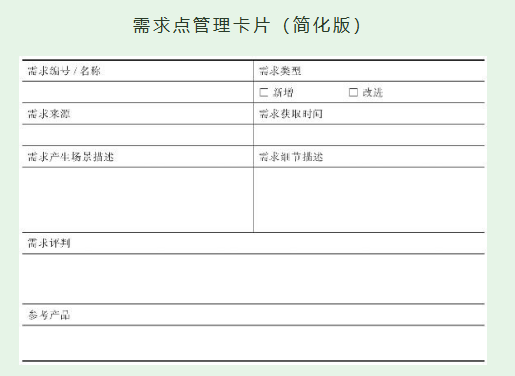

# 第3节　从需求点的角度理解需求管理

* 大的需求可以分拆成更细、更具体的需求点。

## 梳理单个需求点

* 对众多的需求点进行管理，可以借助一些工具提高工作效率——需求点管理卡片

* 要填好这张卡片，并不像看上去那么简单。产品新人要多练习，先按自己的理解尽力填写，让问题甚至错误暴露出来。然后去争取产品经理的指点，这样做能力增长更快。

## 为众多需求点排优先级

* 判断一个需求点的优先级，一般从三个方面考虑：与战略的相关性、对用户的影响、技术实现。

### 判断与战略密切程度

* 与战略密切的优先做，不太密切的稍后做

### 判断影响面和影响程度

* 涉及用户多的、跟核心用户利益有关的、不做会有严重问题的需求点，都是要优先满足的需求点

### 评估实现难度和成本

* 为需求排优先级时特别容易引起争执。如果久争不下，就需要有个人站出来说：“听我的，我承担责任！”这个人多数情况下应该是产品经理，有时可能需要CEO来说这句话。

* 产品新人就从对部分需求的管理开始，逐渐增强需求管理能力。
* 产品新人掌握了基本方法后，还要靠边实战边思考的方式来增长需求管理能力。通常要经过多次迭代，再加上自己认真复盘，才会慢慢有点感觉。

### 随手练习

* 为你接下来一个月要学习的产品知识点排个优先级

|            | 知识点 | 排序理由 |
| ---------- | ------ | -------- |
| 最高优先级 |        |          |
| 次优先级   |        |          |
| 低优先级   |        |          |

