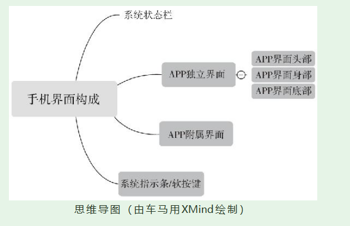
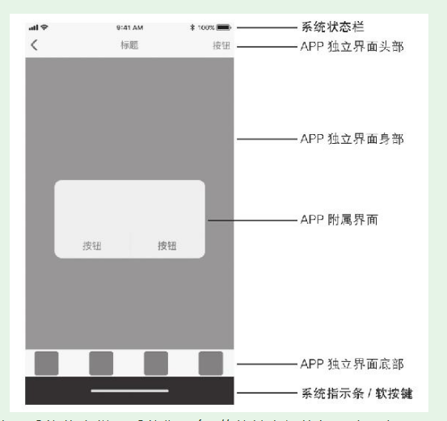
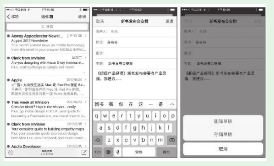
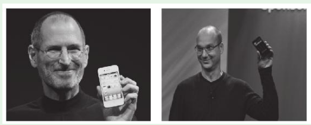
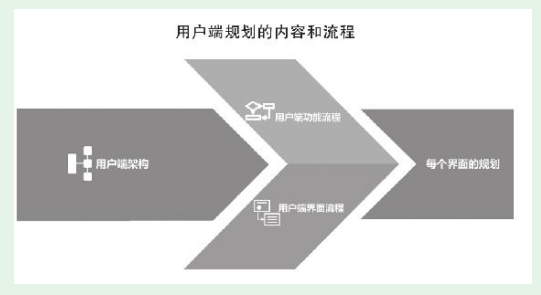

# 第1节　App端规划的基础知识

## 手机界面、App界面的结构

### 手机界面构成

* iOS和Android两平台界面，整体结构是相同

### App独立界面

（1）界面头部
（2）界面身部
（3）界面底部

### App附属界面

## App端规划概述

### 整体规划、版本规划、App端规划

* 产品整体规划是对产品进行全局、全程、全方位的规划，通过一个个版本规划来落实产品。如果某个版本只有一个用户端，那么落实时版本规划就相当于用户端规划；

### App的两个主要系统平台

* iOS之父Steve Jobs，右图是Android之父Andy Rubin

### App端规划的内容和流程

* App端\Web端，涉及的内容和流程

