# 第3节　理解iOS和Android规范

* **做App规划时，产品人不是在天马行空地乱做，而是在系统平台提供的强大能力和重重约束中进行创造。**
* iOS屏幕和Android屏幕对比如下

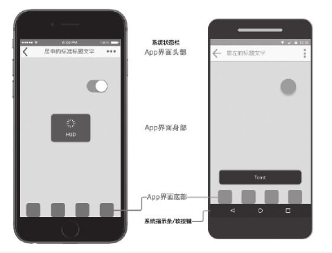

* 随手练习：

    

  把一台iPhone手机、一台Android手机并排放在桌上。打开两部手机上的微信，完成几个典型任务（发朋友圈、查收消息、搜索、看公众号文章等）进行同步对比操作，找出三处不同并记录下来。

  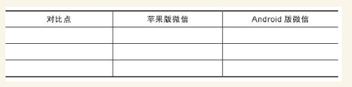

## iOS界面指南的主要内容

* 苹果官方制定了iOS App的规划指南——Human Interface Guidelines，这个指南随着iOS的版本升级而变化。新人可以先看本书，再去细读整个指南。建议英语好的，直接读官方的英语原文。

### iOS的长度计量单位——pt

* 物理像素pixel，缩写为px
* 像素密度，普遍用PPI(pixels per inch)表示

* iOS中更方便的长度计量单位是逻辑像素point，简称为pt。point的中文名称叫“磅”，是从印刷行业借用过来的单位。1pt=1/72英寸，也就是说72pt=1英寸
* iPhone从5到X的屏幕数据(iPhone 4/4s及更早的机型目前已基本退出使用，所以上表没有列出)

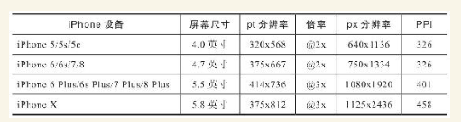

### 构成界面的三大类元素之一——5种栏

* 指南中有三大类元素：栏、视图、控件。产品人规划App界面时，就是将这些基本元素有机组合起来

（1）状态栏（Status Bar）

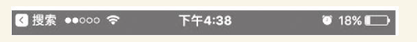

（2）导航栏（Navigation Bar）

导航栏可以显示返回、标题、搜索框、分段式控件，还可以提供其他功能。

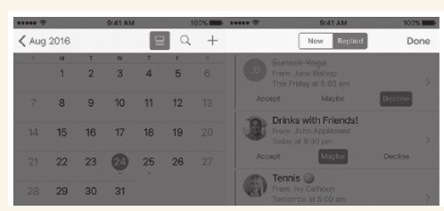

（3）搜索栏（Seach Bar）及搜索范围栏（Scope Bar）

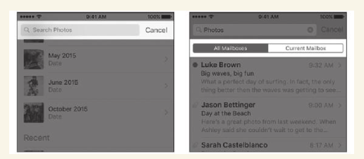

（4）工具栏（Tool Bar）

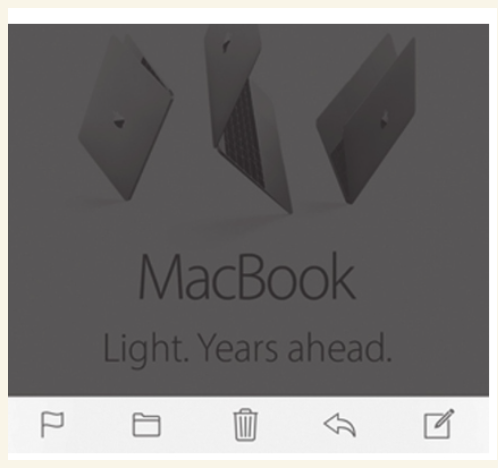

（5）标签栏（Tab Bar）

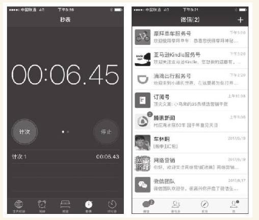

### 构成界面的三大类元素之二——13种视图

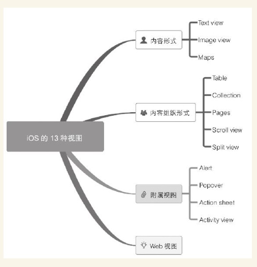

* 很多App没有适当使用这些附属视图，造成很多用户体验问题。稍后会专门讲这块内容
* 附属视图中的Alert、Action sheet的标准样式。

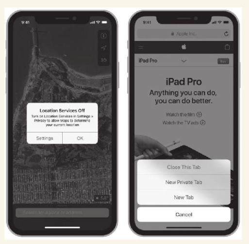

* 随手练习：

    

  打开一个你常用的iOS App，在它的操作首界面中看能发现哪些视图，可以写下来

### 构成界面的三大类元素之三——12种标准控件

（1）按钮（Buttons）；

  

（2）编辑菜单（Edit Menus）；

  

（3）标签（Labels）；

  

（4）页面控件（Page Controls）；

  

（5）选择器（Pickers）；

  

（6）进度指示器（Progress Indicators）；

  

（7）刷新控件（Refresh Content Controls）；

  

（8）分段控件（Segmented Controls）；

  

（9）滑块（Sliders）；

  

（10）步进器（Steppers）；

  

（11）开关（Switches）；

  

（12）文本框（Text Fields）。

* **规划iOS平台上的App，核心内容就是：**

    

  （1）规划一个个相关的界面，通常有统一的导航考虑。

    

  （2）App界面分为独立界面、附属界面两大类。

    

  （3）将栏、视图、空间三类元素有机组成一个个界面。

## 初步了解Android平台的Material Design理念

* MD是一个被产品人严重忽略的好东西，值得产品人系统研究。研究的第一步就是细读MD全文。

### 长度计量单位dp

* 单位长度内的像素数量就是分辨率，通常用PPI（Pixel Per Inch）
* 一个56dp宽的按钮，在不同PPI的屏幕中用到的物理像素数量是不同的，但如果用一把尺子来量，其宽度却是一样的。这个单位使得产品人在规划时，避免了众多PPI的困扰

### 神奇的材料

* （1）材料的厚度是固定的——1dp，形状和二维尺寸是可变的。
* （2）材料可以伸展、收缩、合并、分拆，但不能弯曲、折叠、彼此穿插。
* （3）材料可以承载任何形式的内容，内容不增加材料厚度。可以将每个材料理解为一个显示屏，显示屏上就算显示的是喜马拉雅山，显然也不会增加屏的厚度。
* （4）一个界面通常由多张材料构成。

### 屏幕里的3D世界

* 除了屏幕X、Y轴数据，还有垂直于显示平面的Z轴数据，其中Z轴数据叫作高程
* 同样形状、大小的卡片通过阴影表现出来的不同Z轴高度。非常明显，从左到右，阴影越来越重，视觉上感觉“浮”得越来越高。

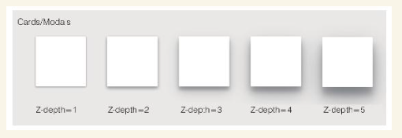

### Android标准组件及其规范

* Material Design把界面的组成元素称为compenents（组件）
* 包括Bottom Navigation（底部导航）、Bottom Sheets（底部菜单）、Chips（列表项）、Floating Action Buttons（悬浮动作按钮）、Modal Bottom Sheets（模态底板）等
* 这些标准组件有很详细的使用规范。下面以Android标志性的组件——Floating Action Button（悬浮动作按钮）为例

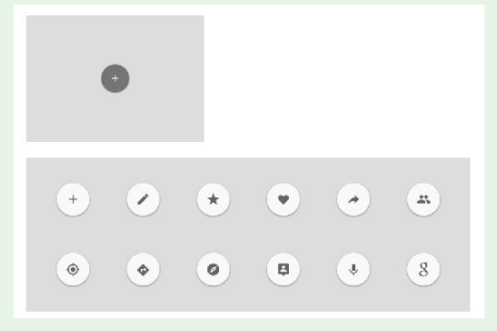

* 上图中所示的圆形按钮都是Floating Action Button。看上去只要是圆形的按钮就行了？其实有很多规范来约束它。

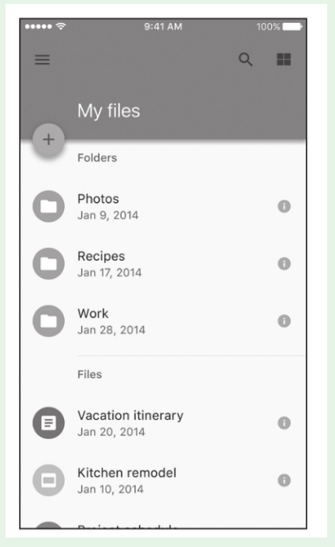

* 如：
  ·标准尺寸56dp×56dp，小尺寸40dp×40dp。
  ·推荐每个界面只出现一个，用于最常用的、主要的动作。
  ·应该是创建、分享等积极动作，而不是删除等负面动作。
* 不同类型的组件以及组件处于不同状态时，有不同的高程也就是Z轴数据。
  新人想要系统了解Material Design，可以访问它的官网material.io

## 认识iOS和Android App的区别

* 两个平台的区别主要体现在四个方面，如下图所示。


### 头部的区别

* 头部本来是独立界面的一部分，但因为很常见而且显眼，用户的感知很强，所以将这部分的区别单列一项

### 界面元件的区别

* 界面元件就是组成界面的“零部件”。
* 两个平台还有少数不能直接对应的元件，例如，iOS上的HUD（Head Up Display）和Android上的Toast，这两个尽管都用于提示，但两个元件不能直接对应。

### 附属界面的区别

* 附属界面及其构成元素的分类方式和定义各有一套，并不是严格一一对应的，下面有一张对比表，对两个平台的附属界面做了对比

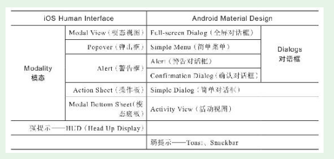

* 中文翻译目前不统一，很容易造成混乱，所以建议以英文为准，中文翻译只做参考。如上表所示，两个平台附属界面的对应关系分三种情况：一对一、一对二、无对应

### 操作方式、交互动效的区别

* 对相同的对象，两个平台在默认操作方式、交互方式上存在很多不同，例如，返回上级界面的方式、列表项操作方式、提示窗显隐方式、轻点控件后的动效等

### 尊重和接受双平台的区别

* 为双平台做规划，首先要尊重和接受双平台的区别。在功能相同的情况下，不必追求App在两个平台上的完全相同，因为要考虑用户习惯和实现成本。
* 因为Android系统对该动效原生支持，Android端开发人员要实现这个效果（本例是有边界的涟漪效果），只需针对控件写一行代码即可：

```
android：background="？android：attr/selectableItemBackground"
```

iOS上实现这个动效，就不像Android那么简单了，需要经过很多步骤，这些步骤落实下来，要写上百行代码

* 苹果公司对iOS掌控力强，应用审查也比较严格，所以实战中iOS的规范执行得较好。
* Android的MD尽管Google自己的应用实践得不错，但因为深度定制版众多，很多深度定制版自身对MD规范的执行不太好，众多App执行得就更差了。结果很多产品的Android App长得很像iOS App，成了一种很常见的现象。

### 实战中对规范的突破和融合

* 实战中很多App对规范进行了突破和融合，并没有那么严格地遵循规范。