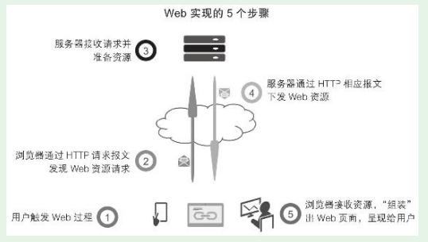

# 第1节　Web端规划概述

## Web规划设计的基础技术知识

* 技术的限制与技术提供的可能性，这二者是我们产品人真正关心的。我们掌握基本的技术知识，就是为了对技术的限制（什么效果实现不了？）和技术的可能性（居然可以实现这个功能？）有更清晰地理解，帮助我们做好产品。

* 而Web端同时受到硬件、操作系统、浏览器的限制

### 高度概括的Web实现的五个步骤

### Web技术知识体系

* 基础的Web技术知识体系

·万维网原理；
·HTML标签语言；
·CSS层叠样式表；
·JavaScript编程；
·HTTP传输协议、JSON数据交互格式；
·服务器端编程；
·数据库与SQL语句。

### Web端技术对产品规划的约束

* （1）本地资源难调用。
* （2）断网基本不可用
* （3）功能不如App强大。

* 掌握基本的Web技术知识，不是要让产品人自己进行开发，理解Web的内在机理，这样才能规划出好的产品Web端。
* 系统掌握一点Web技术知识，也便于和Web端开发人员更好地沟通合作

## Web端规划的主要内容

### 整站的页面结构规划

* 确定整个网站的树状结构，有哪些页面，以及页面之间的层级关系。

### 全局规划：header、footer、全局导航、全局交互、404页面等

* 影响整个Web端的规划，想清楚了能节省很多时间。
* 在原型中进行全局交互说明，效率更高

### 各个页面的单独规划

###  专门的交互规划

* 全局交互规划不能覆盖，就需要进行专门的交互规划

### 市场、运营活动页面的专门规划

* 前几步是常规，这一步常常被忽略。一般认为，产品、运营活动页面应该交给市场、运营部门去做。但实战中发现，这些页面有一些鲜明的特点：时效性强、聚焦主题、有较强的数据采集考虑等。如果完全交给市场、运营来做，因为这些部门不是专业的产品部门，会有很多问题考虑不到，进而产生很多问题。